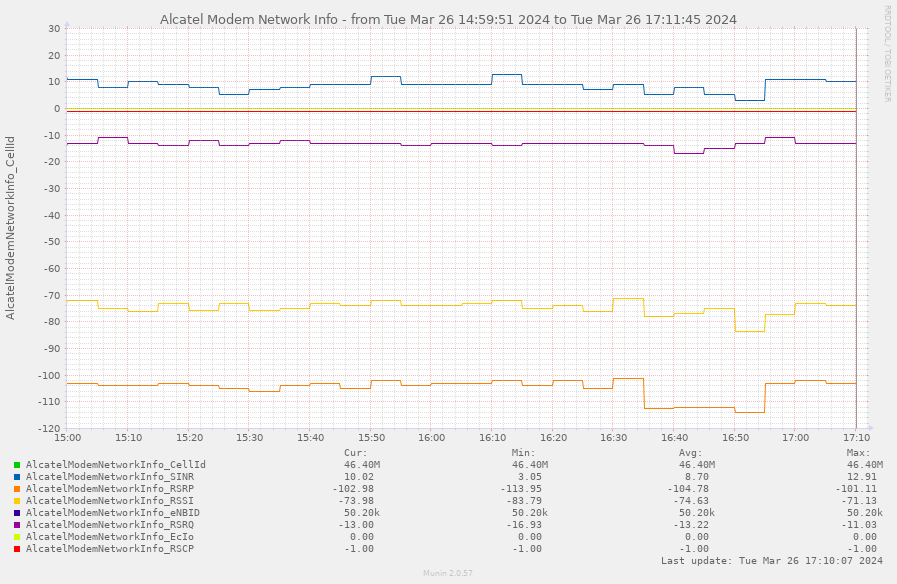
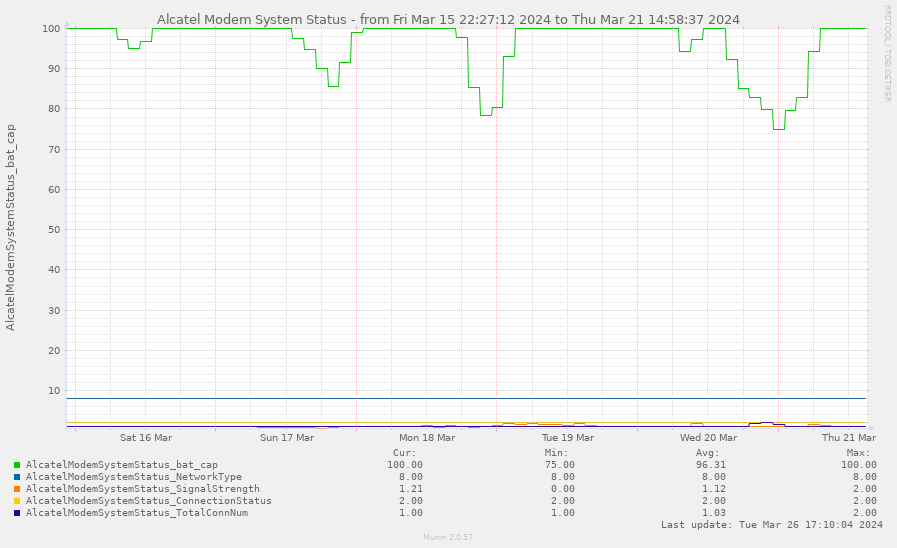

# Plugin for monitoring Alcatel MW40 with Munin

## Info:
* Should also work with other Alcatel WiFi / MiFi routers / modems.

## Requirements:
* PHP (with curl extension)

## Usage:
* copy `alcatelConfig_default.php` to `alcatelConfig.php`
* check instructions in `alcatelConfig.php` file (fill the IP and secret key)
* install in <a href="http://munin-monitoring.org/">munin</a> (and remember to restart munin-node -HUP afterwards), wait for munin to regenerate png/htmls.
* have fun! (Use munin's Limit low/high for better visuality.)
* add optional cron entry to log CellID changes (adjust paths to your install location and frequency to your taste)
```
1 * * * * echo "`date +\%Y\%m\%d-%H\%M` - `/var/www/html/alcatelmodem/alcatelModemLogCellID.php`" >> /var/www/html/alcatelmodem/log/alcatelModemLogCellID.log
```

## Sample screenshots:


